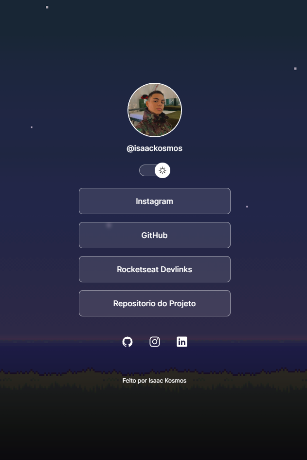

<h1 align="center"> DevLinks </h1>

  Projeto desenvolvido com a aprendizagem de um mini curso da Rocketseat.  
  <a href="https://app.rocketseat.com.br/devlinks">Link do curso</a>

  

## Tecnologias

- HTML e CSS
- JavaScript
- Git e Github

## Sobre o Projeto

O projeto consiste em um agregador de links para ser usado como cartao de visitas.

## Aprendizado

Neste projeto aprendi boas praticas de programacao com as tecnologias alem de aprimorar o meu uso do Git e GitHub.